# 🏋️ Gym Backend API

A RESTful Backend API built using **NestJS**, **MongoDB**, and **Mongoose**.

This project is part of my **Backend End-to-End Mastery Program**, where I am learning to build scalable backend applications using NestJS and MongoDB.

---

## 🚀 Tech Stack

- NestJS
- TypeScript
- MongoDB
- Mongoose
- Postman
- Git & GitHub

---

## ✨ Features

- ✅ Create Gym
- ✅ Get All Gyms
- ✅ Get Gym By ID
- ✅ Update Gym
- ✅ Delete Gym
- ✅ MongoDB Integration
- ✅ Mongoose Schema
- ✅ Invalid ObjectId Handling

---

## ⚙️ Installation

### Clone the repository

```bash
git clone https://github.com/pragatibhandare05-ux/gym-backend.git
```

### Install dependencies

```bash
npm install
```

### Run the application

```bash
npm run start:dev
```

The server will start at:

```
http://localhost:3000
```

---

## 📌 API Endpoints

| Method | Endpoint | Description |
|---------|----------|-------------|
| GET | `/gym` | Get all gyms |
| GET | `/gym/:id` | Get gym by ID |
| POST | `/gym` | Create a gym |
| PUT | `/gym/:id` | Update a gym |
| DELETE | `/gym/:id` | Delete a gym |

---

## GET API Response

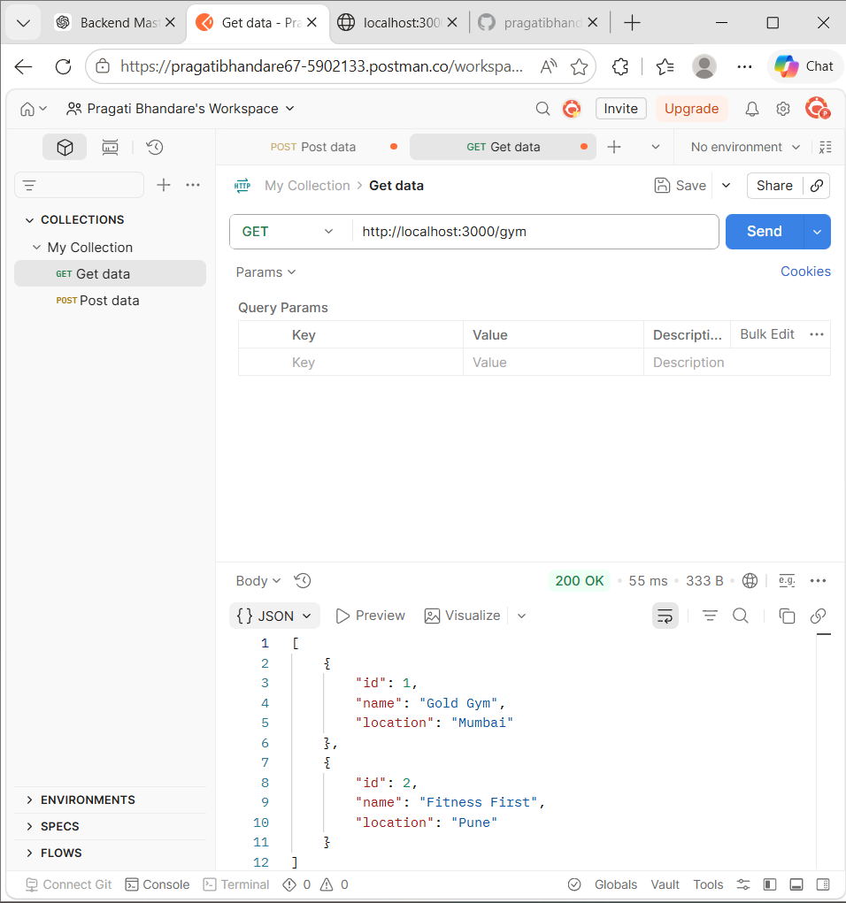

## POST API Response

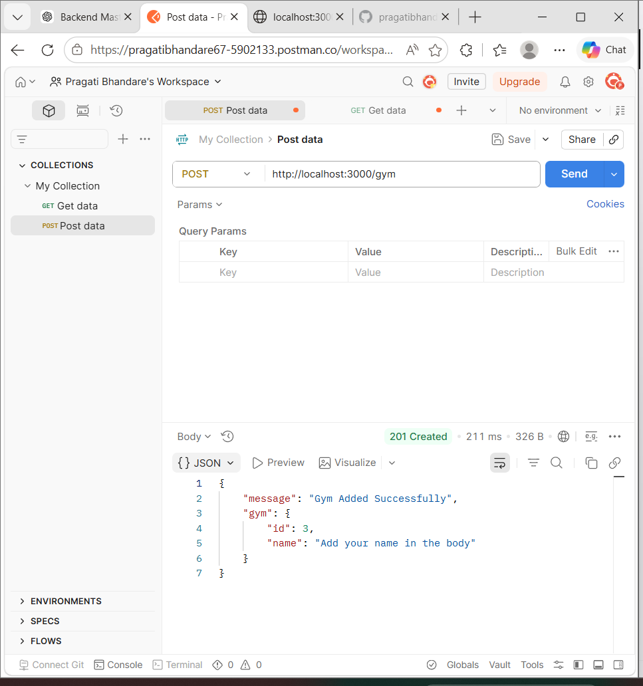

## NestJS Server Running

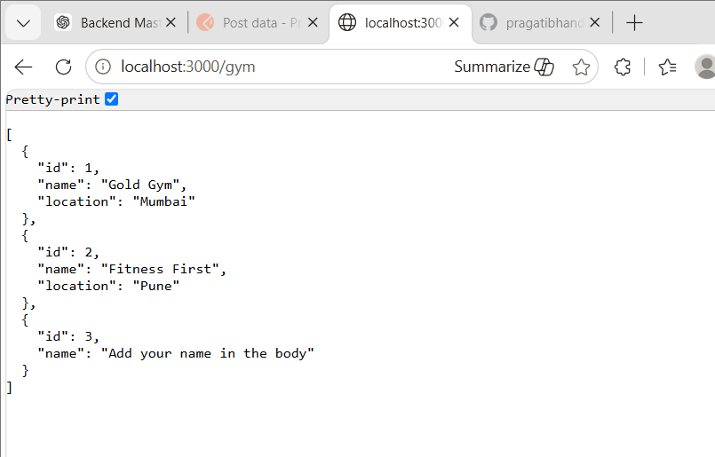

# 📸 Day 2 Screenshots

### GET API Response (Browser)

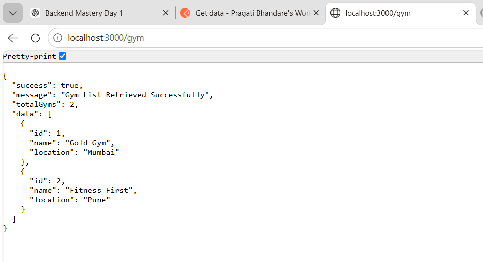

### GET API Response (Postman)

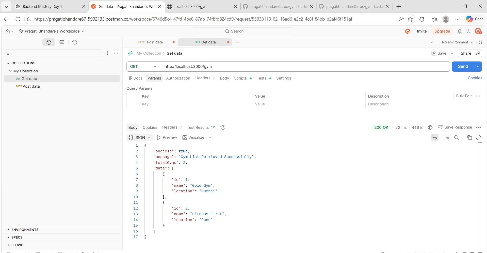

### Validation Error

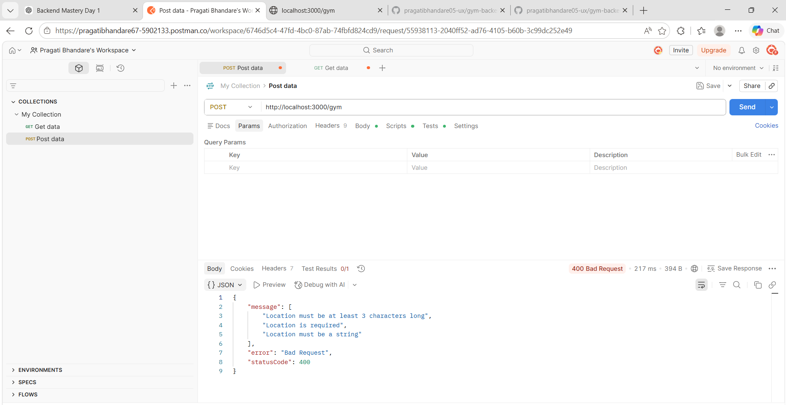

---

# 📸 Day 3 Screenshots

### MongoDB Connected

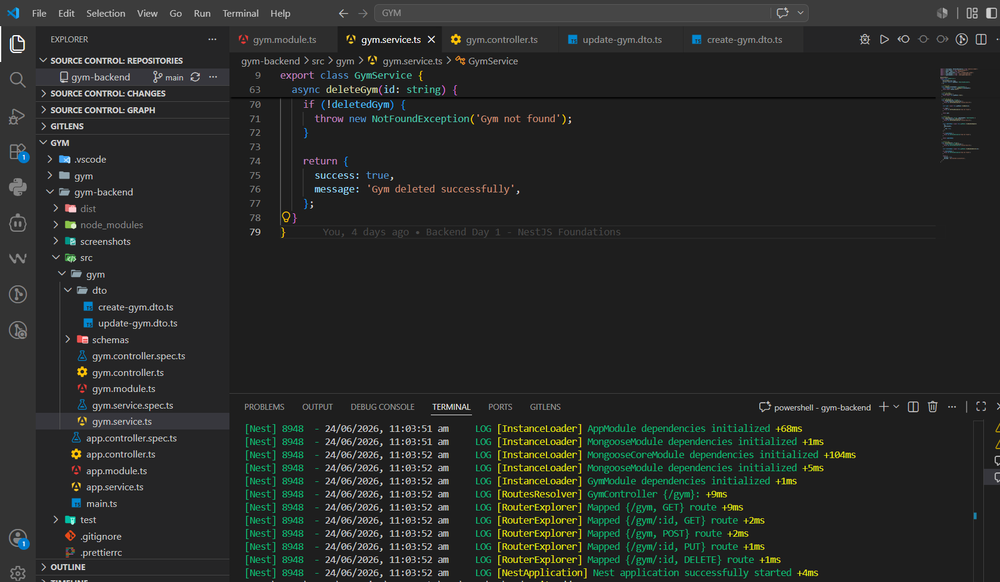

### Create API

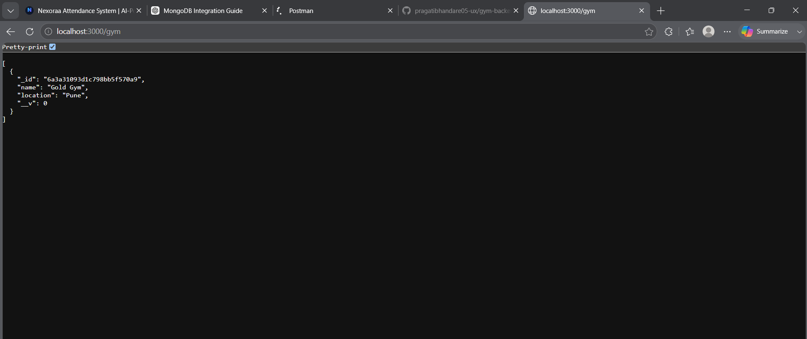

### Get All API

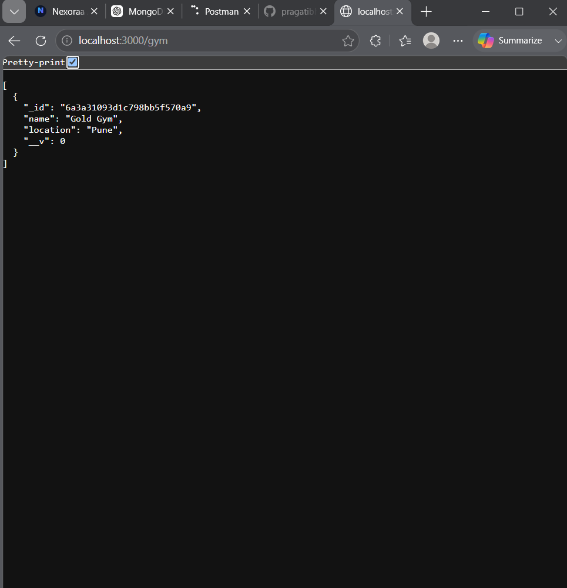

### Get Gym By ID

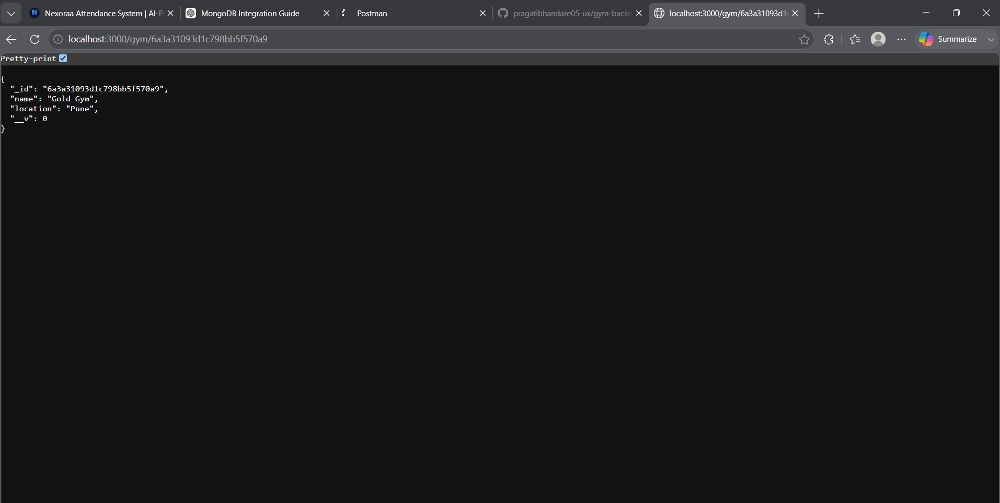

### Update API

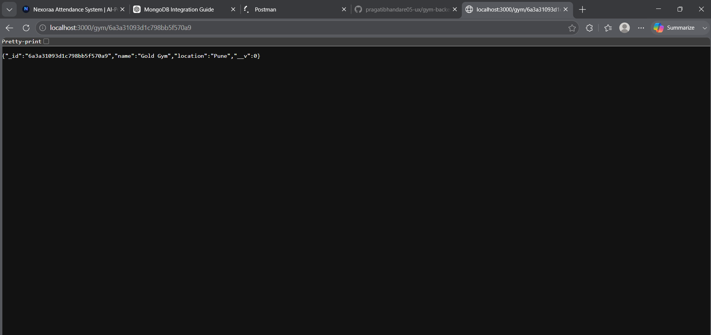

### Delete API

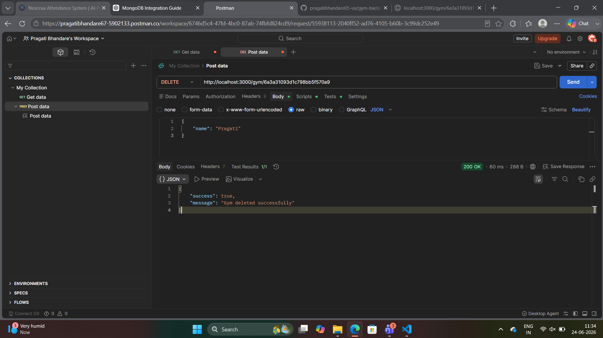

### Invalid ObjectId Handling

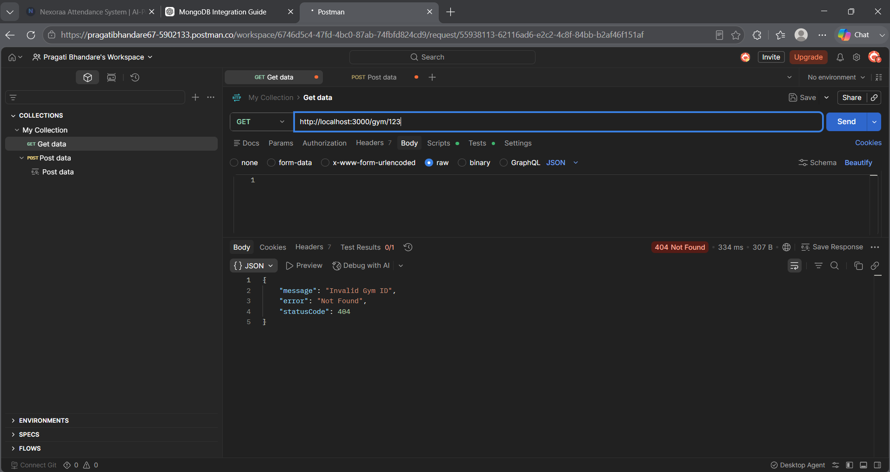

### MongoDB Compass

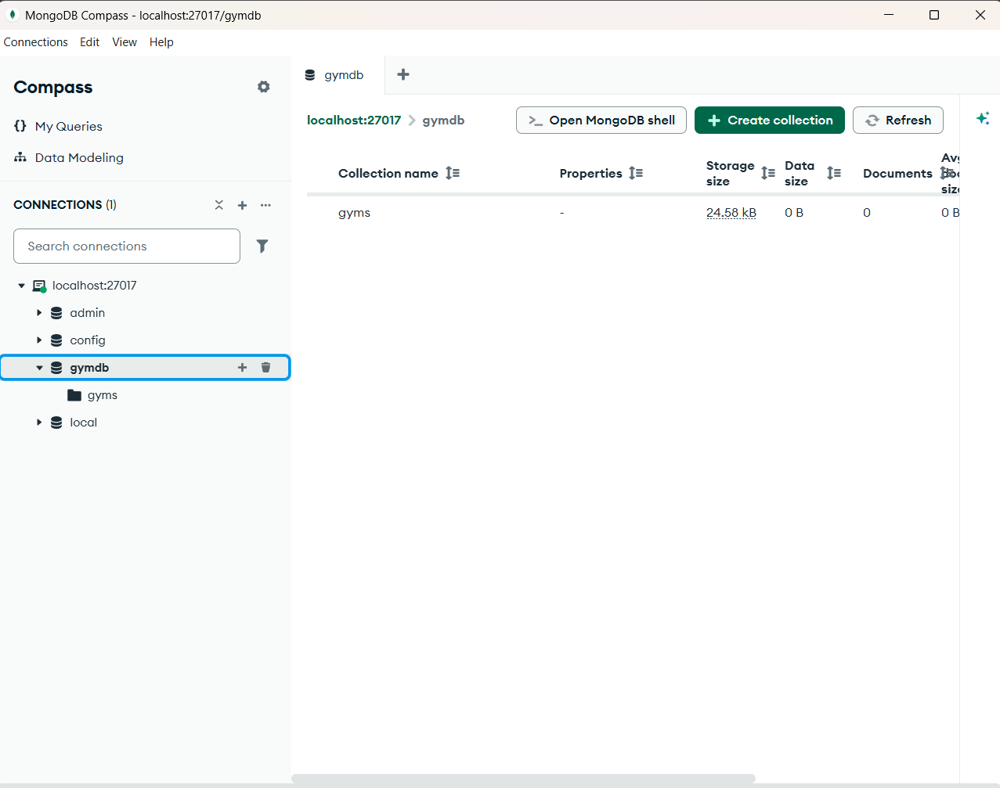

---

## 📚 Learning Progress

- ✅ Day 1 – NestJS Foundations
- ✅ Day 2 – REST APIs
- ✅ Day 3 – MongoDB CRUD with Mongoose
- ⏳ Day 4 – Authentication (JWT & bcrypt)

---

## 👩‍💻 Author

**Pragati Bhandare**

GitHub: https://github.com/pragatibhandare05-ux